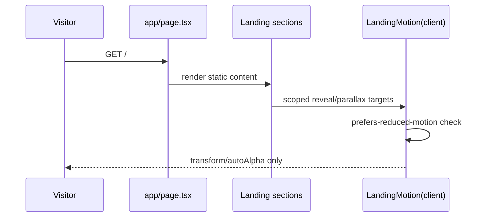

# Design: Landing Page GSAP Interactivity

## Technical Approach

Replace the root redirect in `app/page.tsx` with a static public landing page composed from `components/landing/*`. Keep `app/page.tsx` as a Server Component and isolate GSAP in small client-only wrappers so the page stays readable, token-driven, and SSR-safe. Dashboard routes, `AuthProvider`, and sidebar behavior remain unchanged.

## Architecture Decisions

| Decision | Choice | Alternatives considered | Rationale |
|---|---|---|---|
| Page boundary | `app/page.tsx` imports section components and exports static metadata/content. | One large page file. | Matches Next App Router page docs and keeps sections reviewable. |
| Motion | Create `components/landing/landing-motion.tsx` with `useEffect`, `gsap.matchMedia().add(..., scope)`, and cleanup. | Use existing `motion` dependency or global scripts. | User requested GSAP; scoped matchMedia contexts prevent leaks, support reduced motion, and avoid SSR issues. |
| Visual primitive | Create `components/landing/ambient-orb.tsx`; leave `components/orbs/orb.tsx` unchanged unless later reused intentionally. | Modify the current R3F/audio-reactive `Orb`. | Existing `Orb` is heavier and voice-state oriented; landing needs subtle token-based ambience. |
| Styling | Use shadcn `Button`, `Card`, `Badge`, `MarvaIsotype`, Tailwind 4 tokens (`bg-card`, `text-muted-foreground`, `from-primary/5`, `chart-*`) with public copy branded as `Know.ly`. | Hard-coded brand colors. | Preserves dark mode and existing visual language while keeping public brand consistent. |

## Data / Render Flow

Content order: hero, problem/current-state gap, product promise, workflow/agent steps, dashboard preview with conceptual metrics, benefits, final CTA to `/auth` plus in-page learn path.

## File Changes

| File | Action | Description |
|---|---|---|
| `app/page.tsx` | Modify | Replace `redirect('/dashboard')` with landing composition. |
| `components/landing/landing-page.tsx` | Create | Section orchestration and shared page shell. |
| `components/landing/landing-hero.tsx` | Create | Brand mark, headline, learn-first CTA, hero preview. |
| `components/landing/landing-sections.tsx` | Create | Problem, promise, workflow, benefits, and CTA sections. |
| `components/landing/dashboard-preview.tsx` | Create | Token-styled product preview inspired by cards/charts, with no fake unverified metrics unless labeled. |
| `components/landing/landing-motion.tsx` | Create | Client-only GSAP setup and scoped animation wrapper. |
| `components/landing/ambient-orb.tsx` | Create | Lightweight decorative orb using token classes/CSS variables. |
| `package.json`, `bun.lock` | Modify | Add `gsap`. |

## Interfaces / Contracts

`LandingMotion` accepts `children` and optional class names, scopes selectors such as `[data-landing-reveal]`, and uses `gsap.matchMedia().add(query, handler, scope)` with `media.revert()` cleanup. Reduced motion keeps essential content visible and disables or shortens decorative motion. Animations use `autoAlpha`, `y`, `scale`, `xPercent`, and stagger; avoid `top`, `left`, `width`, and layout reads.

## Testing Strategy

| Layer | What to Test | Approach |
|---|---|---|
| Static checks | TS, ESLint, formatting | `bun run typecheck`, `bun run lint`, `bun run format` if needed. |
| Build | App Router SSR/client split | `bun run build`. |
| Manual QA | Responsive layout, dark mode, reduced motion, CTA targets | Browser verification since no test framework exists. |

## Migration / Rollout

No migration required. Rollback is reverting `app/page.tsx`, deleting `components/landing/*`, and removing `gsap`.

## Open Questions

- [ ] Browser QA still needs manual verification across mobile, tablet, desktop, light mode, dark mode, reduced motion, and CTA behavior.
